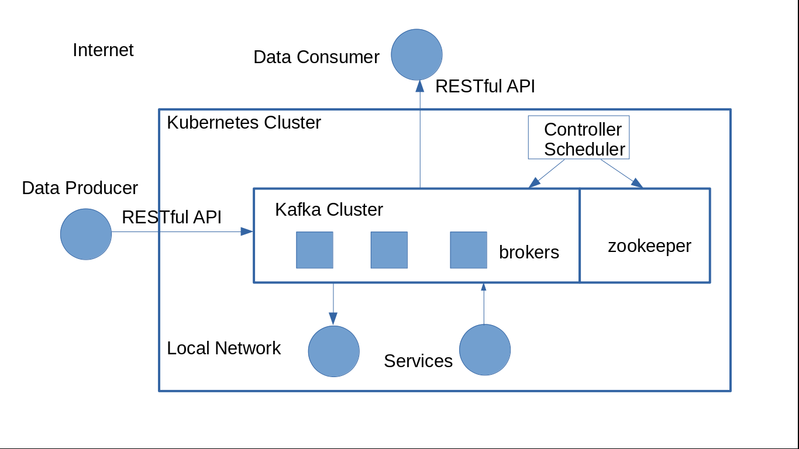

# Introduction

The purpose of creating this project is to design an efficient, distributed, scalable, and cross-language data transmission system. The system is designed based on Kafka, and the entire system is built on the basis of a kube cluster. The system will implement a unified data read and write interface, whether on the external network or the internal network. The system will also achieve standardized implementation and configuration of common services. In addition, the system should automatically scale up or down, and automatically load balance.

During designing this system, I referenced and integrated the work of others, here I would like to thank them in particular, they are:

@solsson [kubernetes-kafka](https://github.com/Yolean/kubernetes-kafka)

# Environment

This system is built on a kube cluster, so you first need to create a cluster.

# Structure and tools



Note: The numbers in the image above correspond to the numbers below

The image above shows the structure of this system. Its core is Kafka. Here I use the concepts of producer and consumer in Kafka. Generally speaking, producers<sup>1</sup> and consumers<sup>1</sup> are not part of the system. The system provides them with data transmission services through a unified interface. The system can be deployed on the cloud, so that it can provide cloud services through RESTful APIs. In addition, by integrating other functions<sup>2</sup> locally, such as data collection, storage, query, and fusion, it can provide data processing and analysis services<sup>2</sup> in the cloud. I will integrate these functions into this system, users can choose different function components<sup>2</sup> to deploy according to their needs. In addition, the system automatically expands and reduces the size of the service or other adjustments by monitoring<sup>3</sup> the traffic in the data transmission process and the status of each service node<sup>4</sup>, thereby achieving the purpose of load balancing.


# Usage

```
kubectl apply -k .
```


